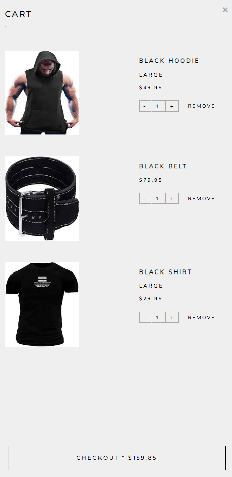

# ADFitGear
[View the live site](https://ad-fit-gear.herokuapp.com/#/)

ADFitGear, inspired by [BMFitGear](https://www.bmfitgear.com/), is an e-commerce store where users can view and buy product listings for fitness gear and apparel. 

# Technologies Used
### Backend
* Ruby on Rails
* PostgreSQL
### Frontend
* React/Redux
### Other
* Rails Active Storage
* Amazon S3
* SCSS
* Webpack
* Heroku

# Features
* User Authentication
* Product Listings
* Search
* Shopping Cart
* Ratings/Reviews

### User Authentication
Users can create an account and log in. User authentication for this web application was made using the BCrypt gem and SecureRandom module. 

***

### Product Listings
Products are listed for sale and is organized by category. Product listings include images, price, and description.

***

### Search
Users can search for a product by name and can easily view the search results while typing instead of having to navigate away from the page.

***

### Shopping Cart
Users have a shopping cart in which they can add, remove, and update items in their cart. The shopping cart displays all items/products that the user has added. Clicking on the cart item image or name will redirect the user to that product's show page.

***

### Ratings/Reviews
Users can rate and review a product. After creating the review, it is posted on the product's show page.

